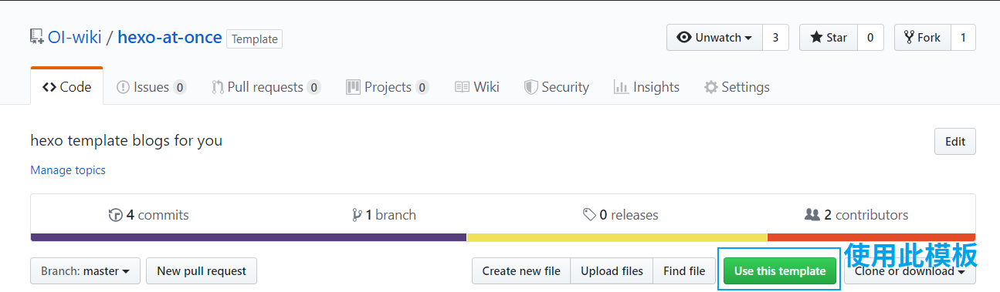
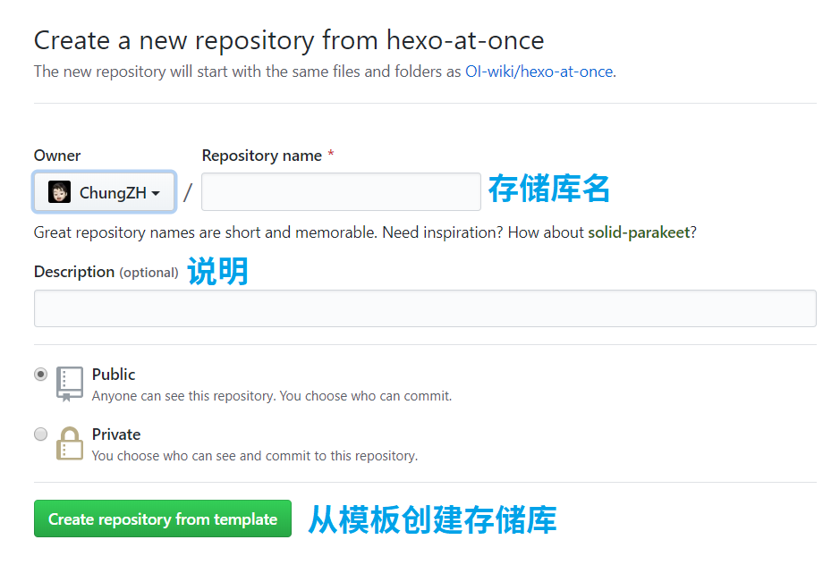

# hexo at once

hexo at once 的目标是帮助 OIer 更方便地记笔记、写博客，让使用者不用关心其它东西，专注于写文章。

[Demo](https://hexo-at-once.netlify.com)

## 特性

- 使用 [hexo-theme-icarus](https://github.com/ppoffice/hexo-theme-icarus) 主题，美观、简洁
- 支持 Mathjax
- 支持 RSS
- 接近“开箱即用”，只需极少配置
- 使用 Markdown 写作
- ······

## 快速开始

### 1. 创建博客存储库

1. 打开 [hexo-at-once](https://github.com/OI-wiki/hexo-at-once) 项目仓库。
2. 点击 Use this template。
   
3. 从模板创建存储库。 
    

这样，你就创建好博客的存储库了！

### 2. 配置博客

~~容我再想想怎么写...~~咕咕咕

### 3. 配置 Netlify

咕咕咕

---

Maintained by ChungZH.